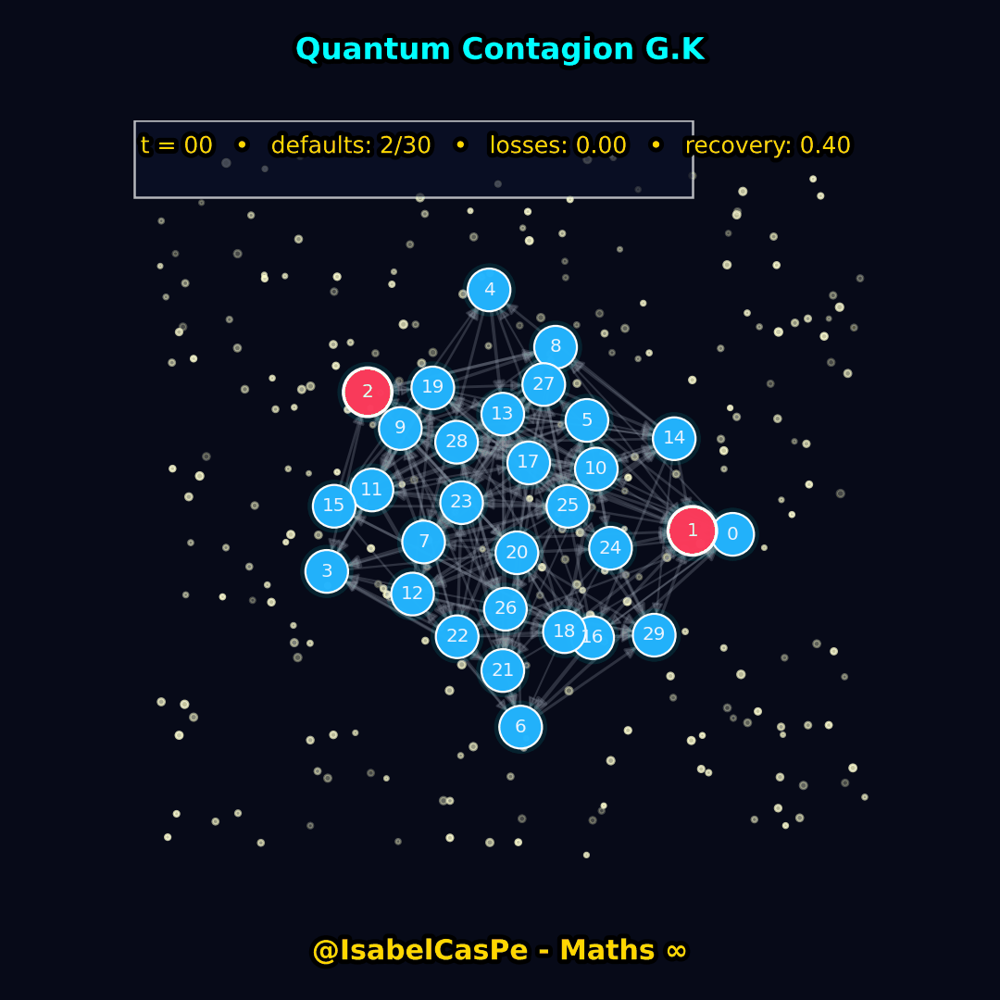

**Sumário** · [Galeria](#galeria-gifs) · [PDE/EDP](#edp--visualizações) · [Fractais](#fractais) · [Cálculo](#cálculo)
---
> Arte & Ciência em Movimento — Matemática Viva 💎🧮✨  
> @IsabelCasPe 💎
---
##  isabelcaspe.github.io
# 🌐 IsabelCasPe – Site Profissional
🌐 Site pessoal de Ana Isabel Castillo Pereda - Professora, Pesquisadora e Mentora em Matemática Aplicada.

Bem-vindo ao site profissional de **Ana Isabel Castillo Pereda**, Professora, Pesquisadora e Mentora em Matemática Aplicada.

Este espaço reúne meus projetos computacionais, visuais e educacionais com foco em Cálculo, Finanças, Sistemas Dinâmicos, Controle, EDPs e Métodos Numéricos.

O site está disponível em três idiomas: 🇧🇷 Português, 🇬🇧 English, 🇪🇸 Español.  
🔗 Acesse: [isabelcaspe.github.io](https://isabelcaspe.github.io)

---

## 🔢 Repositórios em Destaque

Explore projetos com códigos, exercícios, animações e aplicações reais:

- 🌐📊 [QuantDataScienceX](https://github.com/IsabelCasPe/QuantDataScienceX): Ciência de Dados com foco em aplicações quantitativas e financeiras.
- 📘 [Calculus-I-III](https://github.com/IsabelCasPe/Calculus-I-III): Curso completo de Cálculo I a III com aplicações em Finanças.
- 📚 [Fourier-EDP-Solutions](https://github.com/IsabelCasPe/Fourier-EDP-Solutions): Exercícios de Séries de Fourier e EDPs.
- 📖 [SuperProf_Alunos](https://github.com/IsabelCasPe/SuperProf_Alunos): Materiais para alunos com tutoriais.
- 💻 [Sistemas-Dinamicos](https://github.com/IsabelCasPe/Sistemas-Dinamicos): Códigos de Conjuntos de Julia e sistemas caóticos.
- 📝 [Cadeia-de-Markov](https://github.com/IsabelCasPe/Cadeia-de-Markov): Notas de cursos do IMPA.
- 🧮 [Numerical-Methods](https://github.com/IsabelCasPe/NumerQuantDataScienceXical-Methods): Cálculo Numérico para Engenharia e Ciências Exatas.
- ⚙️ [Controle-Linear](https://github.com/IsabelCasPe/Controle-Linear): Controle Linear para Engenharia e Sistemas Dinâmicos.
- 📊 [Finance-Math](https://github.com/IsabelCasPe/Finance-Math): Matemática Financeira com foco em aplicações e visualização.
- 📚 [Applied-Math-Colloquia](https://github.com/IsabelCasPe/Applied-Math-Colloquia): Livros e materiais avançados em Matemática Aplicada.
- 📘 [Optimal-Control-Systems](https://github.com/IsabelCasPe/Optimal-Control-Systems): Slides e códigos de Controle Ótimo para finanças e engenharia.
- 🌀 [Math-Dynamics](https://github.com/IsabelCasPe/Math-Dynamics): Animações de seno, cosseno e Black-Scholes para Finanças e Matemática Aplicada.
- 🤣 [CalculusComedyGold](https://github.com/IsabelCasPe/CalculusComedyGold): Piadas inteligentes de cálculo e matemática aplicada (Cálculo I-III com humor).

---

##  Sobre Mim

Matemática com alma criativa e foco em aplicações computacionais para a vida real.  
Trabalho com:

- Cálculo (I–III), EDPs, Sistemas Dinâmicos e Controle
- Python, LaTeX, Animações e Visualização Matemática
- Ensino trilingue e pesquisa com impacto social e financeiro

---
## Galeria: Matemática que Brilha - frames de ordem e beleza 💎✨
** Do código ao brilho: matemática viva em GIFs  cálculo, EDPs, fractais, controle e finanças.** 🎞️🎨🔬🧮🌌✨

## BTC vs GLD - Bloomberg Premium Animation

## G. K. Dynamics 💎

### Sinais & Oscilações 🌊 ∇² 📐 ✨

### Combinatória 📈 🧮✨

### Redes & Finanças 📈💹🧮 ∫ ♾️ ✨

### Fractais & Sistemas Dinâmicos 🦋🌀♾️🌌

### Física & Campos 💎

### Geometria & Esferas 🌀♾️🌌✨

---
## 📚 Referências Clássicas

- Stewart, J. (2015). *Cálculo: Volume 1-2*. Cengage Learning.  
- Föllmer, H. & Schied, A. (2016). *Stochastic Finance: An Introduction in Discrete Time*. Walter de Gruyter.   
- Simon, C. P., & Blume, L. (1994). *Mathematics for Economists*. W. W. Norton & Company.

---

## 🔗 Redes e Contato

| Plataforma | Link |
|-----------|------|
| 🌐 Website | [isabelcaspe.github.io](https://isabelcaspe.github.io) |
| 🐙 GitHub | [@IsabelCasPe](https://github.com/IsabelCasPe) |
| 🔗 LinkedIn | [linkedin.com/in/isabelcaspe](https://www.linkedin.com/in/ana-isabel-castillo-pereda-142b0996/) |
| 📸 Instagram | [@isabelcaspe](https://www.instagram.com/isabel_maths/) |
| 🐦 X/Twitter | [@isabelcaspe](https://x.com/anacp20) |
| 🎓 ORCID | [0009-0002-7077-5971](https://orcid.org/my-orcid?orcid=0009-0002-7077-5971) |
| 📺 YouTube | [@IsabelCastillo](https://www.youtube.com/@isabelcastillo4230) |

---
## Licença
- Códigos Python: © 2025  [MIT License](LICENSE)
---
> ✨  "A matemática vibra quando ensinada com beleza e aplicada com alma."  
> © 2025 - Prof. Ana Isabel Castillo 💎
---
